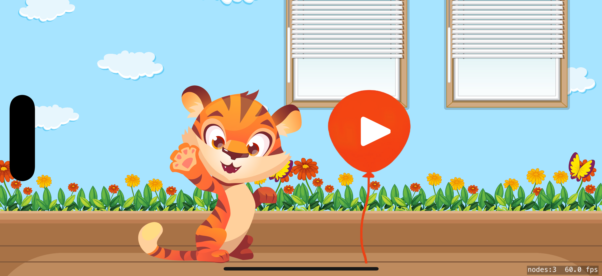
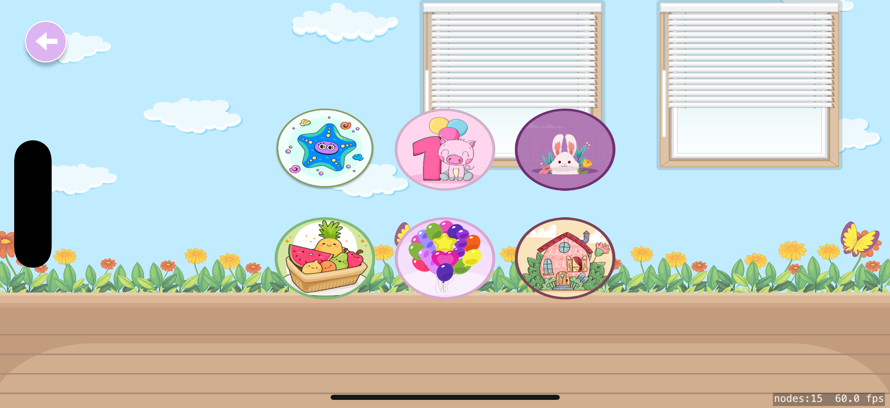
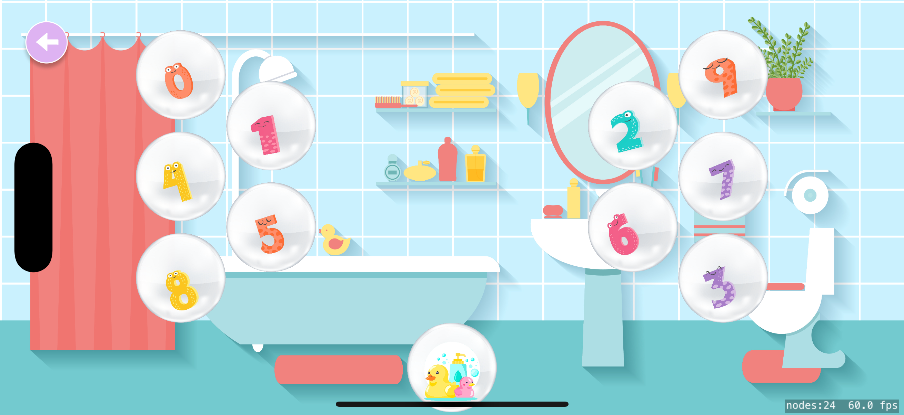
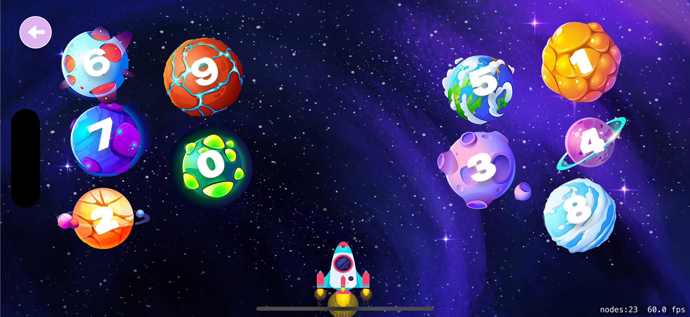
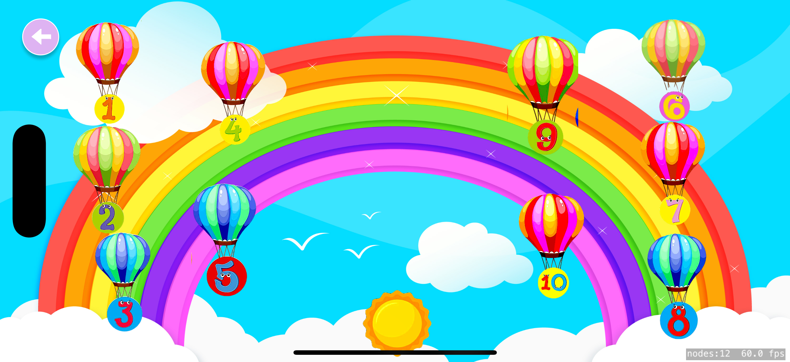
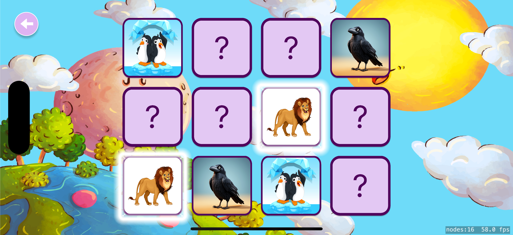
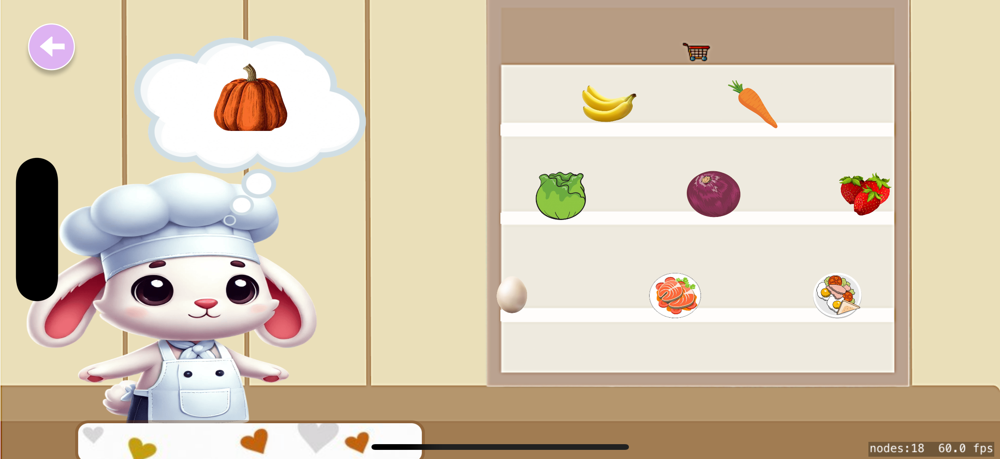
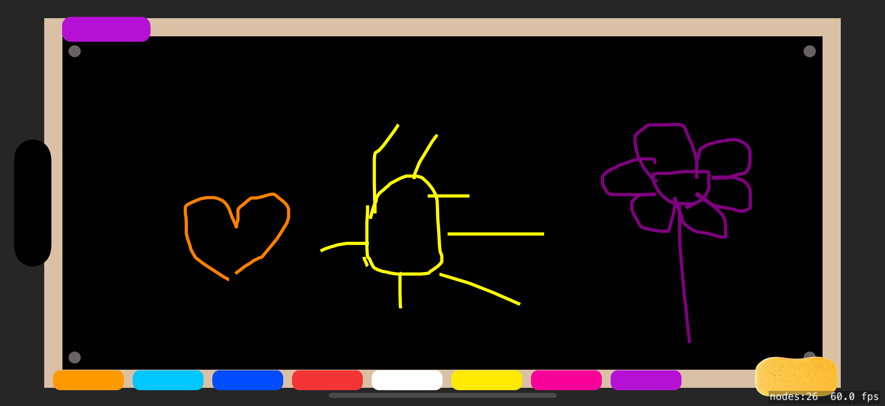

# MiniKids - Çocuklar İçin Öğretici ve Eğlenceli Bir Oyun 🚀

MiniKids, çocuklara özel olarak geliştirilmiş eğlenceli ve öğretici bir SpriteKit oyunu! 👶🎮  
Bu proje de tasarımın birçoğu figmada yapılmıştır ve bana aittir .
# Durum : Geliştirilme Aşamasındadır
---

## Özellikler 🌟
- **Eğlenceli ve Renkli Tasarımlar:** Çocuklara hitap eden görseller ve animasyonlar.
- **Etkileşimli Butonlar:** Her biri özel işlevlere sahip dört farklı buton.
- **Lottie Animasyonları:** Daha akıcı ve dinamik bir oyun deneyimi.
- **Basit ve Kullanıcı Dostu Arayüz:** Küçük yaştaki kullanıcılar için kolay kullanım.

---

## Ekran Görüntüleri 📸

  
  
  
  
  

  
  
  
  
   

> Not: Fotoğraflar düzenlenme aşamasında olup, ilerleyen sürümlerde güncellenecektir.

---

## Geliştirme Teknolojileri 🛠️
- **Swift ve SpriteKit:** Oyun motoru.
- **Lottie Animations:** Canlı ve etkileyici animasyonlar.
- **Xcode:** Uygulama geliştirme platformu.
